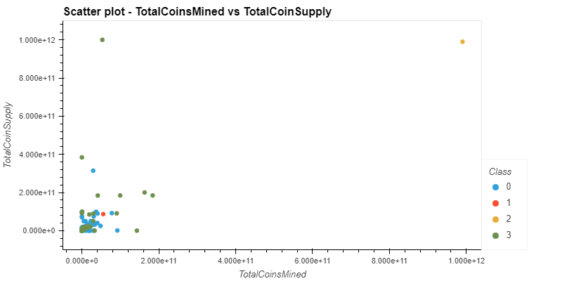

# The Power of the Cloud and Unsupervised Learning

## Background

It is time to take what I have learned about unsupervised learning and the AWS services and apply it to new situations. For this assignment, I will complete **Option 2: Clustering Crypto** challenge which is option 1.

## Work files:
All work files are loacated in the directory:- ClusteringCrypto

[Crypto Clustering](ClusteringCrypto/crypto_clustering.ipynb)

[Optional Challenge AWS - Crypto Clustering](ClusteringCrypto/crypto_clustering_sm.ipynb)

## Option 2: Clustering Crypto

In this assignment, unsupervised learning is used (K-Means Clustering) along with HVPlot visualizations to group crytocurrencies by feature.

## Plots using hvplot:

#### Clustering Cryptocurrencies Using K-Means: Finding the Best Value for "k" using an Elbow Curve:

#### The scatter plot with x="TotalCoinsMined" and y="TotalCoinSupply" Data:

#### Scatterplot of Tradable Currencies:
(partial display)

<table border=\1\ class=\dataframe\>
    <thead>
    <tr style=\text-align: right;\>
        <th></th>
        <th>CoinName</th>
        <th>Algorithm</th>
        <th>IsTrading</th>
        <th>ProofType</th>
        <th>TotalCoinsMined</th>
        <th>TotalCoinSupply</th>
    </tr>
    </thead>
    <tbody>
    <tr>
        <th>42</th>
        <td>42 Coin</td>
        <td>Scrypt</td>
        <td>True</td>
        <td>PoW/PoS</td>
        <td>4.199995e+01</td>
        <td>42</td>
    </tr>
    <tr>
        <th>365</th>
        <td>365Coin</td>
        <td>X11</td>
        <td>True</td>
        <td>PoW/PoS</td>
        <td>NaN</td>
        <td>2300000000</td>
    </tr>
    <tr>
        <th>404</th>
        <td>404Coin</td>
        <td>Scrypt</td>
        <td>True</td>
        <td>PoW/PoS</td>
        <td>1.055185e+09</td>
        <td>532000000</td>
    </tr>
    <tr>
        <th>611</th>
        <td>SixEleven</td>
        <td>SHA-256</td>
        <td>True</td>
        <td>PoW</td>
        <td>NaN</td>
        <td>611000</td>
    </tr>
    <tr>
        <th>808</th>
        <td>808</td>
        <td>SHA-256</td>
        <td>True</td>
        <td>PoW/PoS</td>
        <td>0.000000e+00</td>
        <td>0</td>
    </tr>
    <tr>
        <th>1337</th>
        <td>EliteCoin</td>
        <td>X13</td>
        <td>True</td>
        <td>PoW/PoS</td>
        <td>2.927942e+10</td>
        <td>314159265359</td>
    </tr>
    <tr>
        <th>2015</th>
        <td>2015 coin</td>
        <td>X11</td>
        <td>True</td>
        <td>PoW/PoS</td>
        <td>NaN</td>
        <td>0</td>
    </tr>
    <tr>
        <th>BTC</th>
        <td>Bitcoin</td>
        <td>SHA-256</td>
        <td>True</td>
        <td>PoW</td>
        <td>1.792718e+07</td>
        <td>21000000</td>
    </tr>
    <tr>
        <th>ETH</th>
        <td>Ethereum</td>
        <td>Ethash</td>
        <td>True</td>
        <td>PoW</td>
        <td>1.076842e+08</td>
        <td>0</td>
    </tr>
    <tr>
        <th>LTC</th>
        <td>Litecoin</td>
        <td>Scrypt</td>
        <td>True</td>
        <td>PoW</td>
        <td>6.303924e+07</td>
        <td>84000000</td>
    </tr>
    <tr>
        <th>DASH</th>
        <td>Dash</td>
        <td>X11</td>
        <td>True</td>
        <td>PoW/PoS</td>
        <td>9.031294e+06</td>
        <td>22000000</td>
    </tr>
    <tr>
        <th>XMR</th>
        <td>Monero</td>
        <td>CryptoNight-V7</td>
        <td>True</td>
        <td>PoW</td>
        <td>1.720114e+07</td>
        <td>0</td>
    </tr>
    <tr>
        <th>ETC</th>
        <td>Ethereum Classic</td>
        <td>Ethash</td>
        <td>True</td>
        <td>PoW</td>
        <td>1.133597e+08</td>
        <td>210000000</td>
    </tr>
    <tr>
        <th>ZEC</th>
        <td>ZCash</td>
        <td>Equihash</td>
        <td>True</td>
        <td>PoW</td>
        <td>7.383056e+06</td>
        <td>21000000</td>
    </tr>
    <tr>
        <th>BTS</th>
        <td>Bitshares</td>
        <td>SHA-512</td>
        <td>True</td>
        <td>PoS</td>
        <td>2.741570e+09</td>
        <td>3600570502</td>
    </tr>
    <tr>
        <th>DGB</th>
        <td>DigiByte</td>
        <td>Multiple</td>
        <td>True</td>
        <td>PoW</td>
        <td>1.140622e+10</td>
        <td>21000000000</td>
    </tr>
    <tr>
        <th>BTCD</th>
        <td>BitcoinDark</td>
        <td>SHA-256</td>
        <td>True</td>
        <td>PoW/PoS</td>
        <td>1.288862e+06</td>
        <td>22000000</td>
    </tr>
    <tr>
        <th>CRAIG</th>
        <td>CraigsCoin</td>
        <td>X11</td>
        <td>True</td>
        <td>PoS</td>
        <td>NaN</td>
        <td>30000000</td>
    </tr>
    <tr>
        <th>XBS</th>
        <td>Bitstake</td>
        <td>X11</td>
        <td>True</td>
        <td>PoW/PoS</td>
        <td>0.000000e+00</td>
        <td>1300000</td>
    </tr>
    <tr>
        <th>XPY</th>
        <td>PayCoin</td>
        <td>SHA-256</td>
        <td>True</td>
        <td>PoS</td>
        <td>1.199533e+07</td>
        <td>12500000</td>
    </tr>
    </tbody>
</table>

## Plots using Altair:

#### Elbow plot:

#### Scatter plot - PC 1 vs PC 2:

#### Scatter plot - TotalCoinsMined vs TotalCoinSupply:

